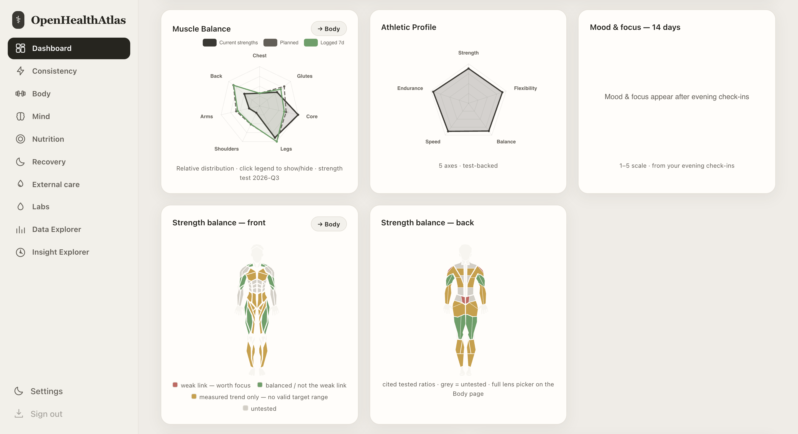

# Open Health Atlas

**Explore your health records together—and check the evidence behind the patterns.**

Created by **[Kajeesan Jeevendra](https://github.com/kajeesan)** · [AGPL-3.0 licensed](LICENSE)

Open Health Atlas brings sleep, training, mood, nutrition and other health
records into one local application. Compare periods and inspect the sources,
units and calculations behind the results.

Use the dashboard on its own, or connect a compatible MCP client to query your
records and verify evidence with the model you choose. Open Health Atlas runs
the calculations; the external model provides the interpretation.

**[Try the fictional demo](https://kajeesan.com/openhealthatlas-demo/) ·
[Connect an MCP client](docs/LOCAL_MCP.md) ·
[Develop the project](docs/DEVELOPMENT.md)**

**macOS desktop preview:** a bundled native app is being verified. See the
[installation and build guide](docs/DESKTOP.md) and
[tested/blocked acceptance matrix](docs/DESKTOP_ACCEPTANCE.md). A notarized
public installer is not yet available; evaluation artifacts are not a normal
public release.

*Fictional UI demo snapshot. [Explore the demo](https://kajeesan.com/openhealthatlas-demo/)
· [Image details](docs/SCREENSHOTS.md).*

## Choose your starting point

**New here? [Start here: install and connect your AI](docs/GETTING_STARTED.md).**
The guide includes copy-paste instructions for a setup agent. Hermes, Telegram,
Google Health, Hevy and a Hostinger VPS have their own sections on the separate
[Optional page](docs/OPTIONAL.md).

| I want to… | Start here |
| --- | --- |
| See the interface without installing anything | [Open the browser demo](https://kajeesan.com/openhealthatlas-demo/) — a clickable, read-only fictional snapshot, with no backend or AI connected. |
| Check the macOS desktop preview | [Installation and release status](docs/DESKTOP.md) (Apple silicon, signed and notarized 0.2.4 preview). |
| Run the real panel and try fictional data locally | [Try the local demo](docs/TRY_DEMO.md#run-the-local-panel) — includes the local API and write broker. |
| Use my preferred AI client with local data | [Connect an MCP client](docs/LOCAL_MCP.md) — copyable setup and a fictional query → analysis → evidence example. |
| Change code or contribute | [Develop the project](docs/DEVELOPMENT.md) — environment, relevant tests and contribution guidance. |

The browser snapshot is useful for exploring screens and navigation; its
values are not a fresh evaluation of the current engine. Run the local demo
to execute calculations, save fictional entries and test imports.

## What you can do

- **Bring records into a shared timeline.** Supported imports and validated
  entry tools cover training, wearables, sleep, nutrition, subjective logs,
  symptoms, laboratory records and other health domains.
- **Explore recorded patterns.** Query summaries or periods, inspect training
  exposure and recovery, and calculate bounded associations across selected
  features. Missing data and source differences remain visible.
- **Check how a result was produced.** Findings retain source, time, units,
  sample coverage, transformations and replayable evidence references.
- **Choose your AI client.** The optional local MCP server exposes discovery,
  query, background analysis and evidence tools. It contains no model and
  makes no provider calls itself.

For example, compare recorded sleep with day ratings over a selected period,
then inspect the number of observations, source coverage and evidence behind
the result. An association can suggest a useful question; it does not establish
why the days differed.

## How the pieces fit

| Component | Responsibility |
| --- | --- |
| Open Health Atlas | Local records, deterministic calculations, validated writes, evidence and dashboard. |
| Your MCP client and chosen model | Conversation, tool selection and interpretation of returned evidence. |
| Optional external Hermes | The existing integrated conversations, Telegram and configured automation workflows. |

The standalone MCP connection is read-only and does not require Hermes. Model
credentials belong in the client. A local database does not guarantee that a
client using a hosted model processes returned data locally.

## Current scope

This is a developer-oriented, single-user source release. Current local setup
supports macOS and Linux with Python 3.11 or newer; native Windows is not
supported by the Unix-socket broker and POSIX file locks. The standalone MCP
entry point uses stdio. Clients requiring remote MCP need a separate transport
setup.

A macOS desktop packaging preview includes the existing dashboard, guided
local workspaces and a bundled optional MCP executable. The [0.2.4 preview](https://github.com/kajeesan/Open-Health-Atlas/releases/tag/v0.2.4)
is prepared for Developer ID signing and Apple notarization; check its
release notes for the exact published artifact. Clean-Mac
installation and the minimum supported macOS remain unverified; this is not
a stable-release qualification claim.
Built-in API-key chat, a hosted multi-user service and a bundled always-on
agent are not included. Existing Hermes and external-service
integrations require their own configuration. Results describe recorded data
and bounded associations; clinical validation and causal conclusions are not
claimed. See [known limitations](UNIMPLEMENTED.md) and the
[feature-retention matrix](FEATURE_RETENTION_MATRIX.md).

## Contribute

Start with [Contributing](CONTRIBUTING.md), the [development guide](docs/DEVELOPMENT.md)
and the [code of conduct](CODE_OF_CONDUCT.md). Look for
[good first issues](https://github.com/kajeesan/Open-Health-Atlas/issues?q=is%3Aissue%20is%3Aopen%20label%3A%22good%20first%20issue%22)
or propose a focused improvement through the issue forms.

Use fictional or redacted reproductions. Report security vulnerabilities through
[the private reporting channel](https://github.com/kajeesan/Open-Health-Atlas/security/advisories/new),
not a public issue.

## Evidence and technical detail

- [Architecture](docs/ARCHITECTURE.md) and [product boundaries](docs/PRODUCT_AUTHORITY.md)
- [Testing](docs/TESTING.md) and [verified results](VERIFICATION.md)
- [Current implementation checkpoint](docs/REFACTORING.md)
- [Service deployment](docs/DEPLOYMENT.md)
- [Repository checks](https://github.com/kajeesan/Open-Health-Atlas/actions/workflows/checks.yml)

## Creator and license

Open Health Atlas was created by **Kajeesan Jeevendra**. Its product
architecture, data/evidence boundaries and user experience were developed and
assembled through an AI-assisted development process.

Original project code uses the [GNU Affero General Public License, version 3
only](LICENSE) (`AGPL-3.0-only`). Commercial use is allowed subject to its
terms, including applicable source-sharing requirements. See
[licensing and earlier MIT releases](LICENSING.md) for details. Preserve
applicable copyright and license notices.
Third-party components retain their own licenses and credits; see
[NOTICE](NOTICE), [third-party notices](THIRD_PARTY_NOTICES.md) and
[research references](REFERENCES.md). Use [CITATION.cff](CITATION.cff) for citation.
